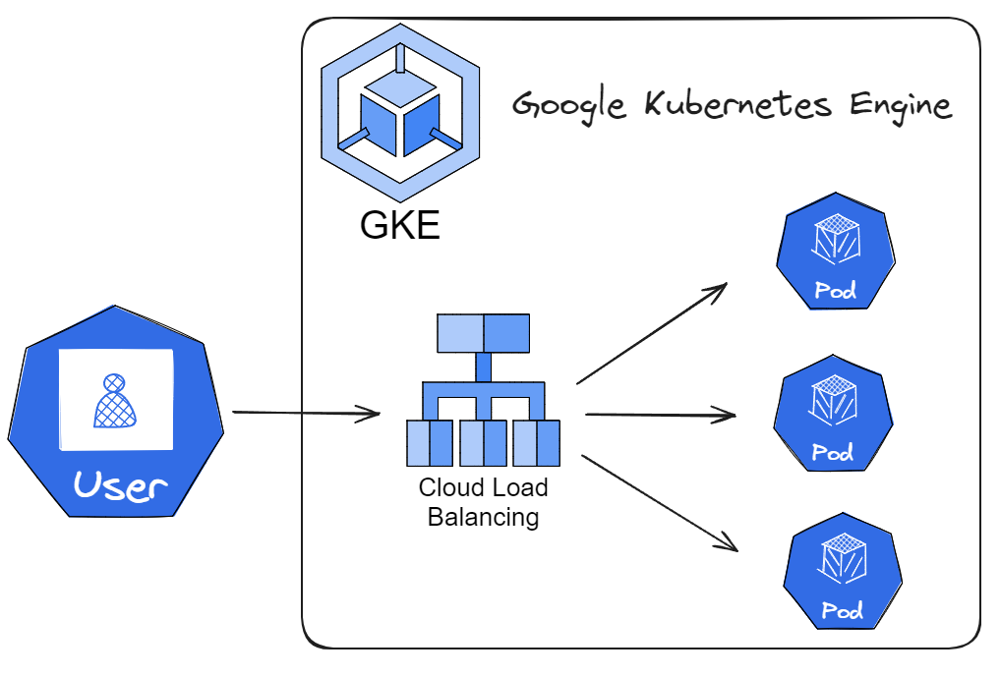
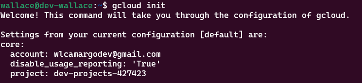
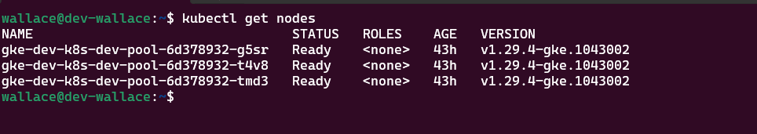
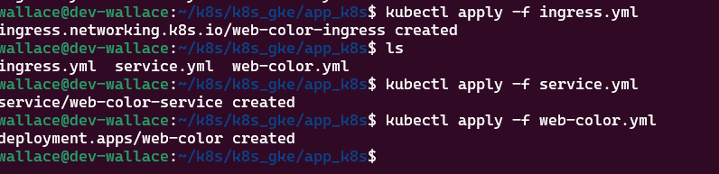
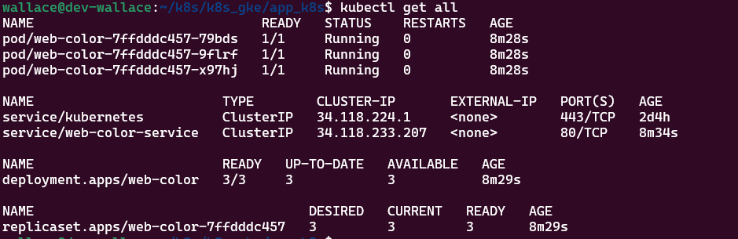
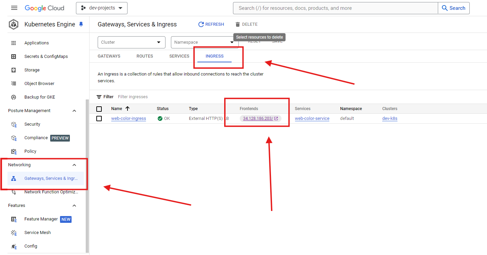
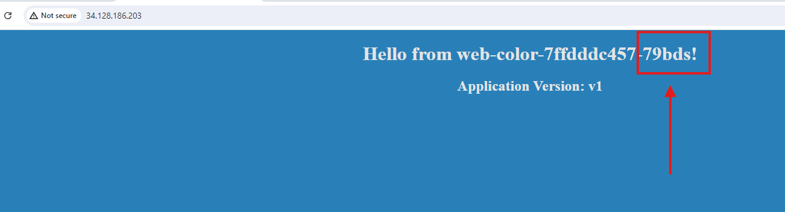
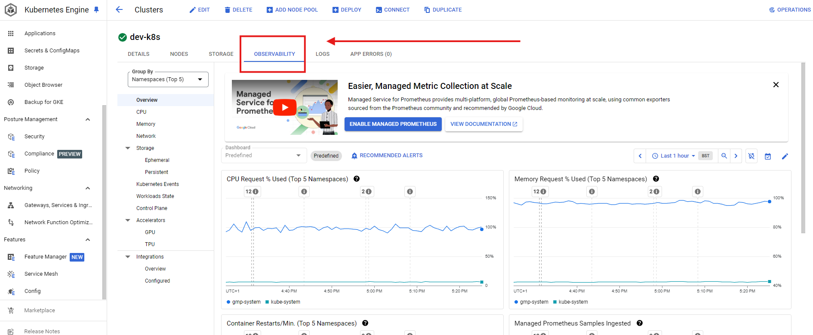
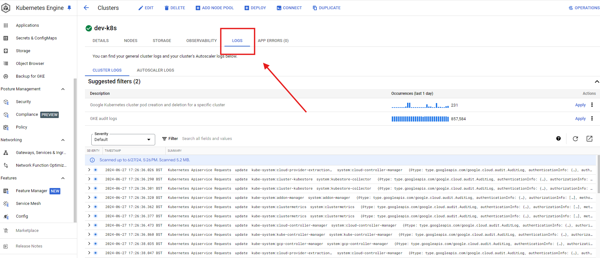

# Deploy no GKE (Google Kubernetes Engine)

O objetivo do projeto é fazer um deploy no Kubernetes gerenciado pela Google Cloud Plataform.

## Arquitetura



## Pré-requisitos
* Uma conta na Google Cloud
* Instalação do gcloud (terminal)
* Instalação do kubectl na gcloud (cli do Kubernetes)
* Criação do cluster Kubernetes

## Como instalar os Pre-requisitos?
### Criar conta na Google Cloud
* Entre no site e crie a conta:

https://cloud.google.com/

### Instalação do gcloud
* Siga as instruções da documentação:

https://cloud.google.com/sdk/docs/install#linux

### Instalação do kubectl 
* Entre no site e siga as instruções:

https://cloud.google.com/kubernetes-engine/docs/how-to/cluster-access-for-kubectl#install_plugin

### Criação do cluster Kubernetes 
* Vídeo tutorial:

https://www.youtube.com/watch?v=zMONJniVIwA

* Criação via gcloud (opcional):

Entre na pasta ```setup```, execute o script ```create-cluster.txt``` no terminal com o gcloud iniciado. Esse script irá provisionar o mesmo cluster que utilizei para este projeto.


## Steps

### Faça clone do projeto
```
git clone https://github.com/wlcamargo/k8s_deploy_gke
```
### Acesse a pasta do projeto
```
cd k8s_deploy_gke
```
### Inicie o gcloud 
```
gcloud init
```
Sample:



## Verifique se os nodes do cluster
```
kubectl get nodes
```
Sample:




### Entre na pasta ```app_k8s``` do projeto 
Nesta pasta contém os manifestos de deploy + service + ingress
```
cd app_k8s
```

### Crie o pod + service + ingress
```
kubectl apply -f ingress.yml
kubectl apply -f service.yml
kubectl apply -f web-color.yml
```
Sample:



### Verifique se os PODS e Services foram criados
```
kubectl get all
```
Sample:



### Vá até o Ingress e acesso o serviço
Atenção! O Ingress leva alguns minutos para ser provisionado.

Sample:



### Aplicação Web-Color
A aplicação Web-Color utiliza o Kubernetes Ingress Controller para balanceamento de carga. Quando você acessa o serviço através do Ingress, as requisições são distribuídas entre os pods disponíveis que executam a aplicação. Cada vez que você atualizar a página, você poderá ver o ID do pod que atendeu a requisição, indicando que o serviço de load balancing está funcionando corretamente.

Sample:



### Observability

Sample:



### Logs

Sample:



## Considerações
Parabéns! Sua aplicação web já está rodando no Kubernetes gerenciado pela Google Cloud Platform. Vale ressaltar que essa é uma das formas mais simples de execução do Kubernetes. 

## Developer
| Desenvolvedor      | LinkedIn                                   | Email                        | Portfólio                              |
|--------------------|--------------------------------------------|------------------------------|----------------------------------------|
| Wallace Camargo    | [LinkedIn](https://www.linkedin.com/in/wallace-camargo-35b615171/) | wallacecpdg@gmail.com        | [Portfólio](https://wlcamargo.github.io/)   |


## References

Fabricio Veronez: https://www.youtube.com/watch?v=gDHmxPlVRZ0&t=6381s

Rafael Botelho: https://www.youtube.com/@rafaelhgbotelho

https://cloud.google.com/


